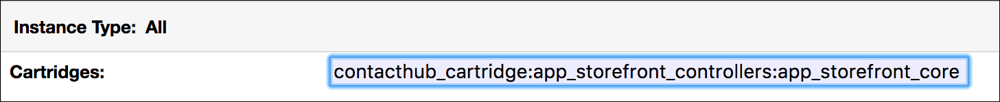
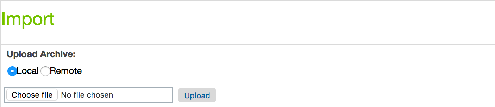
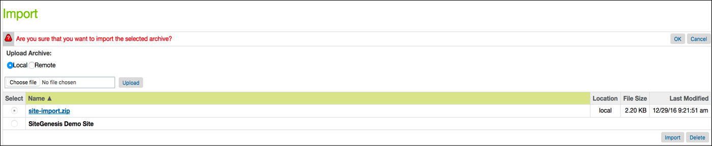
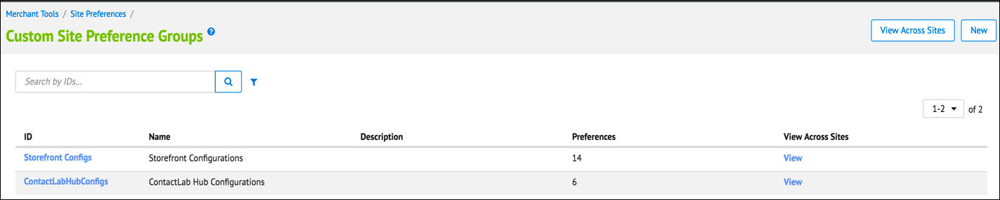
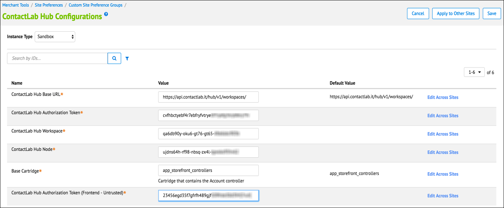

# Contacthub Connect for Salesforce Commerce Cloud  
### Version 0.0.1 beta  
# Installation and Configuration Guide  

----------

## Table of contents

- [Introduction](#Introduction)  
- [Installing the Salesforce Commerce Cloud plug-in](#InstallingPlugIn)  
- [Uploading the cartridge to your sandbox](#UploadingCartridge)  
- [Adding the cartridge to the cartridges path](#AddingCartridgeToPath)  
- [Importing Custom Site Preferences, Services and System Object Extensions together](#ImportingTogether)  
- [Importing Custom Preferences](#ImportingCustomPreferences)  
- [Entering Custom Preferences](#EnteringCustomPreferences)  
- [Custom code](#CustomCode)  
- [Loading the component](#LoadingComponent)  
- [External interfaces](#ExternalInterfaces)  
- [Data storage](#DataStorage)  
- [Which activities does the Salesforce Commerce Cloud plug-in save?](#Salesforceplugin)

<a name="Introduction"/>  

# Introduction  

The Contacthub Salesforce Commerce Cloud plug-in enables you to automatically send all of the activities that your customers undertake on the e-commerce platform to Contacthub, without the need to write any code. The extension automatically collects individual customer information such as:
- The pages they visit
- The products they add to, or remove from, their shopping cart
- The orders they complete

It also ensures potentially valuable information is not lost, by retaining events and actions that are related to customers who have not yet been identified because, for example, they are not logged in, or they have not yet registered. The data is stored by Contacthub, ready to be associated with the customer as soon as they are identified later.

Installing the plug-in is very simple, while activating it requires just a few minutes. 

<a name="InstallingPlugIn"/>  

## Installing the Salesforce Commerce Cloud plug-in

To install the plug-in, complete the steps as described below.  

<a name="UploadingCartridge"/>  

### Uploading the cartridge to your sandbox  

Do the following:  

- Open Demandware Studio  

- Click **File** > **Import** > **General** > **Existing Projects Into Workspace**  

- Browse to the **contacthub_cartridge** folder  

- Click **Finish**  

- When prompted, click **OK** to link the cartridge to your sandbox  

<a name="AddingCartridgeToPath"/>

### Adding the cartridge to the cartridges path   

Do the following:  

- Log in to the **Business Manager**  

- Select your site in the **Administration** > **Sites** > **Manage Sites** menu  

- Select the **Settings** tab  

- Add **contacthub_cartridge:** to the **Cartridges** field  

  

**The Cartridges field with contacthub_cartridge: added**  

- Click **Apply**  

<a name="ImportingTogether"/>

### Importing Custom Site Preferences, Services and System Object Extensions together  

Do the following:  

- In the **Business Manager**, click **Administration** > **Site Development** > **Site Import & Export**  

- In the **Import** panel, click **Choose file** and **upload** the **site-import.zip** that is included in the cartridge  

  

**The Import panel with upload controls**  

- Select **site-import.zip** in the list and click **Import**  

- Click **OK**  

  

**The Import panel with the site-import.zip file**  

<a name="ImportingCustomPreferences"/>

### Importing Custom Preferences  

**Note:**  

This step is only required if your site is not called SiteGenesis.  

Do the following:  

- Details to follow  

<a name="EnteringCustomPreferences"/>

### Entering Custom Preferences  

Do the following:  

- In the **Business Manager**, click **Merchant Tools** > **Site Preferences**  

- Select **ContactLabHubConfigs**  

  

**The Custom Site Preference Groups panel**  

- Complete the relevant fields  

  

**The Contacthub configuration panel**  

- Click **Save**  

<a name="CustomCode"/>

## Custom code  

<a name="LoadingComponent"/>

### Loading the component  

Do the following:  

- Paste the following single line in the <cartridge_name>/cartridge/templates/default/components/footer/footer_UI.isml template file:  

    `<isinclude template="contacthub/contacthub" />`  

<a name="ExternalInterfaces"/>

## External interfaces  

The cartridge connects with Contacthub using the Contacthub API

<a name="DataStorage"/>

## Data storage  

All data is stored on the Contacthub servers. The **Workspace ID**, **Node ID**, trusted and untrusted tokens, are stored as custom site preferences within Salesforce Commerce Cloud.

<a name="#Salesforceplugin"/> 

## Which activities does the Salesforce Commerce Cloud plug-in save?

The following table lists the retained information: 

| Activity        | Description| 
| :------------- |:-------------| 
| Viewed product |When the customer views a product |
| Added product |When the customer adds a product to their shopping cart| 
| Removed product|When the customer removes a product from their shopping cart|
| Order completed | When the customer completes an order | 
| Subscribed to newsletter | When the customer subscribes to your newsletter |
| Unsubscribed from newsletter | When the customer unsubscribes from your newsletter  

----------
